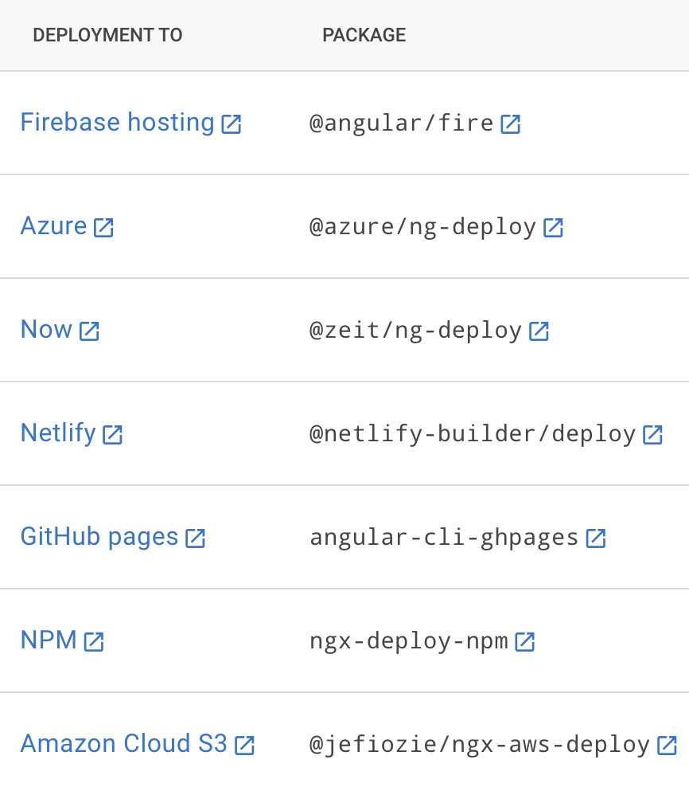
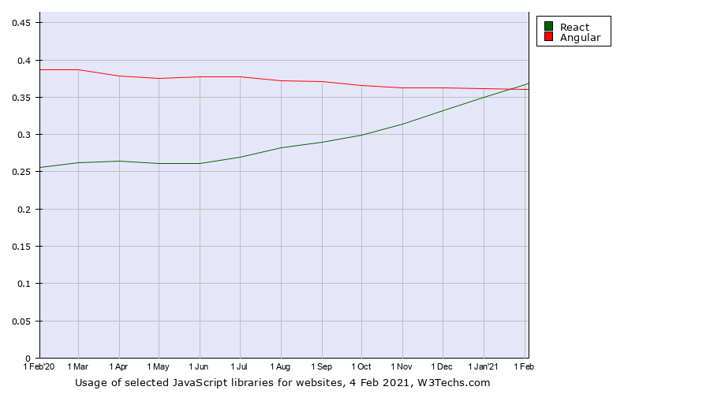

# JS Framework Comparative Analysis

## Framework Name: Angular

### Research Conducted By: Tina Myers, Sowmya Billakanti, Dina Ayoub, Ricardo Barcenas

### Overall Score and Comments

#### Score (Out of 10): 7-8/10

#### General Comments

* Stack is front-end only that is able to be run on mobile as well as web apps.
* Works with single page apps, and custom tags can be created.
* General learnability pretty good with several quality tutorials. With general coding knowledge it can be easily picked up. (If we had more time it would have been much quicker to get a product)
* Angual is much faster in render time because it doesn't just contain one empty div where all of the content is re-created with each refresh.

<!-- Describe the stack (front-end only? full stack?), database, efficiency, etc. Describe the general usability and learnability -->

#### Pros

* Works for mobile and web based apps
* Relatively simple to use for refactoring code, as HTML is able to be brought in with tags
* Information can be passed easily between child and parent elements without needing something special like redux
* Having a strongly typed language limits unpredictable errors if the developer can handle the switch

#### Cons

* Extensive set up and overwhelming file tree
* Steep learning curve, as it relies on typescript (similar to JS, but much more strongly typed)
* Some things (like forms) are overly complicated to implement

### Ratings and Reviews

#### Documentation

* Docs are very through, however are also quite complex, which can make implementing a single feature or functionality more challenging than it would be on other similar frameworks
* Super wordy - not as example based as many other docs are, it was all just paragraph descriptions with very few code examples

#### Systems Requirements

* Can use CORS to connect to back-end which includes the database, but as Angular is front-end, it has no database attached
* Can be deployed to several hosting sites, though downloading the package is required to do so on many of them. See image: 
* Dependencies required for use: typescript installed globally, angular cli installed globally, we also had to use a particular command, `--legacy-peer-deps`, to install the legacy dependencies

#### Ramp-Up Projections

* For a basic app, it would not take long to become productive if the team could wrap their minds around typescript. If typescript were a barrier, it may take a week (just to be able to start, not to become proficient in it) to get comfortable enough with Angular to make a fully functional semi-complex app.

#### Community Support and Adoption levels

* Angular JS is not being supported after one year from now, the angular js site links to the angular site/docs now.
* Google, Microsoft, autodesk, UPS, upwork, paypal, apple, udemy, youtube, AWS(?), grasshopper, forbes, samsung, delta airline, netflix, xbox live, IBM, jetBlue, walmart, New York Times all use either Angular or Angular JS (included since Angular JS is switching to just Angular next year).
* 1.4% of the top 1000 sites use angular vs react's 4.3%
* Since it's created by Google, there is a community of developers supporting it and growing it
* Image below is a graph of the usage trend of angular vs react, with angular trending down slightly and react trending up slightly

### Links and Resources

* [angular framework](https://angular.io/)
* [angular docs](https://angular.io/docs)
* [getting started demo](https://angular.io/start)
* [form demo](https://stackblitz.com/angular/qrqmdgxgqmp?file=src%2Fapp%2Fhero-form%2Fhero-form.component.html)
* [local setup](https://angular.io/guide/setup-local)
* [forms docs](https://angular.io/start/start-forms)

### Code Demos

* [github repository](https://github.com/dinaayoub/salmon-cookies-angular)
* [deployed on netlify](https://salmon-cookies-angular.netlify.app/)

### Operating Instructions

* To set up the machine to be able to use Angular, run the following in the CLI
  * `npm install -g typescript`
  * `npm install -g @angular/cli`
  * `git clone (repository name)`
  * `npm install --legacy-peer-deps`
* To run the app on your local server:
  * Run `ng serve` for a dev server.
  * Navigate to `http://localhost:4200/`.
  * The app will automatically reload if you change any of the source files.

* Endpoint: `/`
  * Returs the homepage with a list of dynamically populated locations.
* Endpoint: `/sales`
  * Returns the sales page with a table listing the number of sales per hour per location, with totals, and a form to add a new locaiton.
  * If the page is not refreshed, the new location will populate on the homepage by clicking "home"
